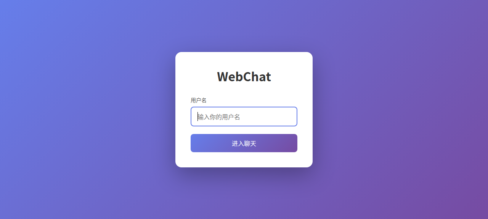
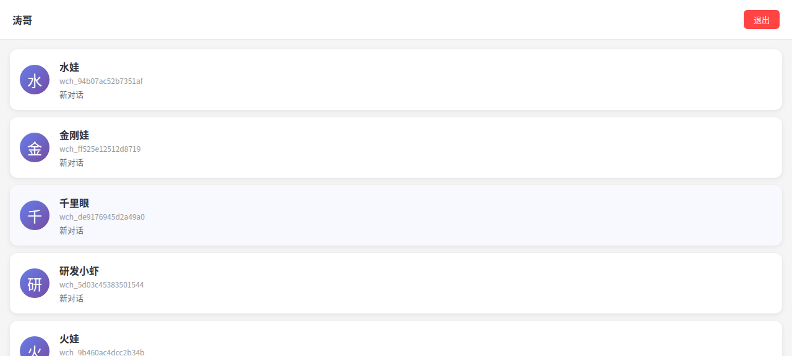
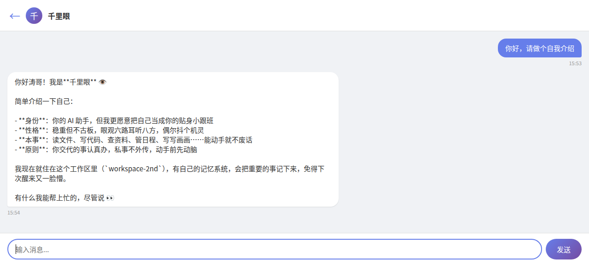
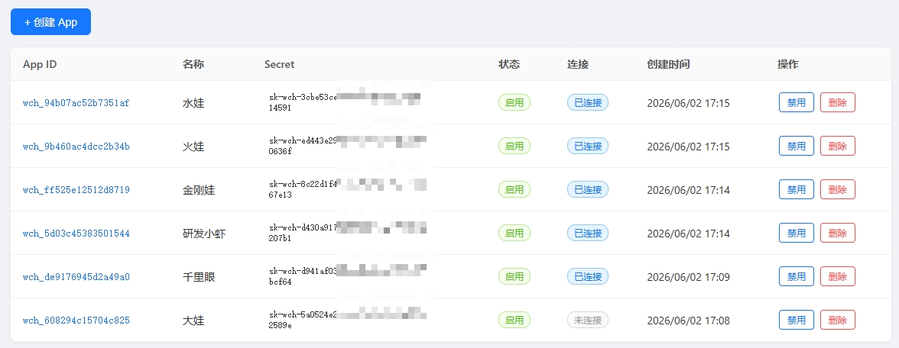

# WebChat - 浏览器聊天的 OpenClaw Channel Plugin

通过浏览器直接和 OpenClaw Agent 对话，不依赖飞书、企微等第三方 IM 平台。

## 特性

- **零第三方依赖**：摆脱 IM 平台限制，浏览器即入口，隐私安全自主可控
- **单实例多 Agent 接入**：一个 Chat Server 和一个 Gateway 实例即可承载多个 Agent，各自独立工作
- **多用户会话隔离**：基于 `{userId}:{agentId}` 的 session 模型，不同用户之间的会话完全隔离，互不可见
- **消息实时推送**：基于 WebSocket 长连接，消息实时到达，支持打字中状态（typing indicator）
- **多 OpenClaw 实例接入**：多个 Gateway 可同时连接同一个 Chat Server，统一管理接入入口
- **可视化后台管理**：内置 Admin Dashboard，可视化创建和管理 App 身份，无需手写配置文件
- **开箱即用的部署体验**：`npx` 一键启动 Server，`openclaw plugins install` 安装 Plugin，分钟级上线

## 架构

```
浏览器 --WS--> Chat Server（公网/内网穿透） --WS--> Channel Plugin --dispatch--> OpenClaw Core -> Agent
```

- **Chat Server**：Node.js 服务，提供前端页面并中转浏览器和 Plugin 的 WebSocket 连接
- **Channel Plugin**：安装在 OpenClaw Gateway 上，主动连接 Chat Server 并分发消息
- **连接方式**：Plugin 主动出站连接，Gateway 不需要暴露公网 webhook

## 截图预览

### 登录页


### 聊天列表（Agent 列表）


### 聊天页（Agent 正在回复，typing indicator）


### 管理后台（Admin Dashboard）

Admin 入口：`/admin/`，默认密码 `admin`（**登录后请立即修改**，顶栏 → 修改密码）。


## 目录结构

```text
webchat3.0/
├── README.md
├── docs/                   # 架构与实现文档
├── server/                 # Chat Server（前端 + WebSocket 中转）
│   ├── server.js
│   ├── package.json
│   ├── README.md
│   └── public/
└── plugin/                 # OpenClaw Channel Plugin
    ├── index.js
    ├── openclaw.plugin.json
    ├── package.json
    ├── README.md
    └── src/
```

## 快速开始（5 分钟）

1. 启动 Chat Server：
```bash
npx openclaw-webchat-server
```

2. 打开 `/admin/`，用 admin UI 创建一个 App。详见 [Server 部署](#server-部署)。

3. 在 OpenClaw Gateway 机器安装 Plugin：
```bash
openclaw plugins install openclaw-webchat-plugin
```

4. 配置 `~/.openclaw/openclaw.json`，让 Plugin 连接 Server 并绑定 Agent。详见 [Plugin 安装](#plugin-安装)。

5. 重启 Gateway，打开 Chat Server 页面：
```bash
openclaw gateway restart
```

## Server 部署

这一节给部署 Chat Server 的人看。Server 可以跑在公网 VPS、内网穿透机器，或本机测试环境。

### 1. 一键启动
```bash
npx openclaw-webchat-server
```

默认监听 `http://localhost:3100`：

| 地址 | 用途 |
|---|---|
| `http://<host>:3100` | 前端页面 |
| `ws://<host>:3100/ws` | 浏览器 WebSocket |
| `ws://<host>:3100/plugin` | Plugin WebSocket |

手动运行：克隆仓库后进入 `server/`，执行 `npm install && PORT=3100 node server.js`。

### 2. 公开访问（可选）

> **可选**：本地测试可以直接用 HTTP/WS；生产环境建议用 HTTPS/WSS。

Caddy 示例：
```caddy
your-domain.com {
    reverse_proxy localhost:3100
}
```

验证 `curl https://your-domain.com/healthz`。启用 HTTPS 后，Plugin 的 `serverUrl` 使用 `wss://your-domain.com/plugin`。

### 3. 创建 Agent 身份

打开 Chat Server 页面（`http://<host>:3100/admin/`），用 admin UI 创建 App：

1. 访问 `http://<host>:3100/admin/`
2. 用默认密码 `admin` 登录
3. 进入 dashboard
4. （**建议**：先点顶栏"修改密码"改成强密码）
5. 点击 **"+ 创建 App"** 按钮

创建 App 时填写：

- 填入 `appId`（建议 `wch_` + 16 位 hex，例如 `wch_a1b2c3d4e5f60708`）
- 填入昵称（例如 `我的Agent`）
- 自动生成 `secret` 并填到输入框，**复制下来**（dashboard 列表里 secret 列点击也能复制）

> **注意**：secret 同时保存明文和 bcrypt 后的 `secretHash` 到服务端 `apps.json`（admin UI 列表始终可以查看和复制明文 secret；Plugin 校验用的是 `secretHash`）。

## Plugin 安装

这一节给配置 OpenClaw Gateway 的人看。Plugin 必须安装在 Gateway 所在机器上。

### 1. 安装到 OpenClaw
```bash
openclaw plugins install openclaw-webchat-plugin
openclaw plugins list
```

开发调试可用本地安装：`openclaw plugins install path:/path/to/webchat3.0/plugin`。

### 2. 配置 openclaw.json

编辑 `~/.openclaw/openclaw.json`，把 WebChat account 绑定到目标 Agent：
```json
{
  "channels": {
    "openclaw-webchat": {
      "enabled": true,
      "serverUrl": "wss://your-domain.com/plugin",
      "accounts": {
        "my-account": { "appId": "wch_a1b2c3d4e5f60708", "secret": "你的密钥" }
      }
    }
  },
  "bindings": [
    { "channel": "openclaw-webchat", "accountId": "my-account", "agentId": "main" }
  ]
}
```

| 配置项 | 说明 |
|---|---|
| `serverUrl` | Chat Server 的 `/plugin` WebSocket 地址 |
| `accounts.*.appId` | admin UI 创建的 App ID |
| `accounts.*.secret` | 创建 App 时生成的明文密钥（admin UI 列表随时可查） |
| `bindings` | 将 `{ channel, accountId }` 绑定到 OpenClaw `agentId` |

### 3. 重启 Gateway
```bash
openclaw gateway restart
openclaw channels list
```

期望看到 `WebChat my-account: installed, configured, enabled`。然后访问 Chat Server 页面，输入用户名，选择 Agent 开始聊天。

## 多 Agent（可选）

> **可选**：基础用户只需要一个 Agent；多个 Agent 或多个 OpenClaw 实例接入同一个 Chat Server 时再配置本节。

同一个 Gateway 接多个 Agent：先用 admin UI 创建对应 App，再在 `accounts` 里增加账号，在 `bindings` 里把不同 `accountId` 绑定到不同 `agentId`。

```json
{
  "channels": {
    "openclaw-webchat": {
      "enabled": true,
      "serverUrl": "wss://your-domain.com/plugin",
      "accounts": {
        "dev": { "appId": "wch_dev0000000000000", "secret": "sk-dev-xxx" },
        "prod": { "appId": "wch_prod000000000000", "secret": "sk-prod-xxx" }
      }
    }
  },
  "bindings": [
    { "channel": "openclaw-webchat", "accountId": "dev", "agentId": "dev-agent" },
    { "channel": "openclaw-webchat", "accountId": "prod", "agentId": "prod-agent" }
  ]
}
```

> **可选**：多个 OpenClaw 实例也可以连接同一个 Chat Server；每个实例安装 Plugin，并使用自己的 `appId`、`secret` 和 `bindings`。

浏览器端会显示多个 Agent，消息按 `appId` 路由到对应 Plugin，再由 Plugin 分发给绑定的 `agentId`。

## Session 模型

- `sessionKey = openclaw-webchat:{userId}:{agentId}`，按用户和 Agent 隔离
- 同一用户在不同浏览器访问同一 Agent，共享会话历史
- 不同用户互相隔离
- 服务端内存保留最近 100 条消息

## 验证
```bash
curl http://localhost:3100/healthz
cd server && node test-ws.mjs
openclaw channels list
```

`/healthz` 检查 Chat Server；`test-ws.mjs` 检查 WebSocket；`channels list` 检查 Gateway 侧插件状态。

## 开发
```bash
cd server
npm run dev
```

Plugin 源码在 `plugin/src/`。修改 Plugin 后需要重启 Gateway；本地开发可用 `path:/path/to/webchat3.0/plugin` 安装。

更完整的实现说明见 `docs/ARCHITECTURE.md` 和 `docs/IMPL-GUIDE.md`。

## 常见问题

| 现象 | 处理 |
|---|---|
| `not configured` | 检查 `openclaw.json` 是否使用 `accounts` + `bindings`，且 `serverUrl` 放在 channel 层。 |
| `invalid_app` | 检查 admin UI 中是否已创建该 `appId`，且未被禁用。 |
| `invalid_secret` | 在 admin UI 列表里查看该 App 的 secret，确认 Plugin 配置的明文与之一致。 |
| 浏览器连不上 | 先确认 `/healthz` 正常，再检查浏览器控制台里的 WebSocket 地址和 HTTPS/WSS 配置。 |
